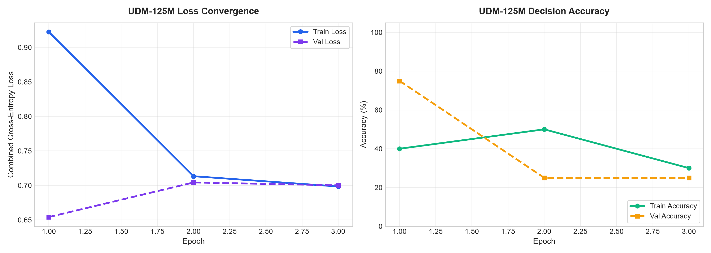
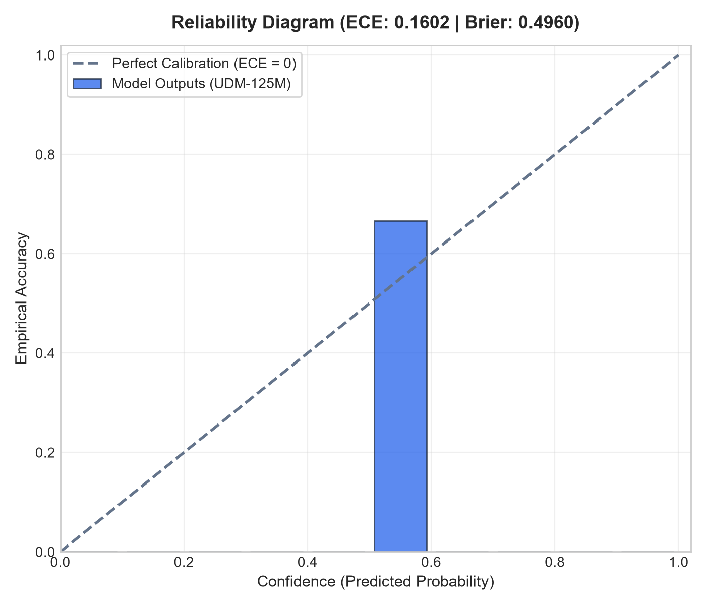
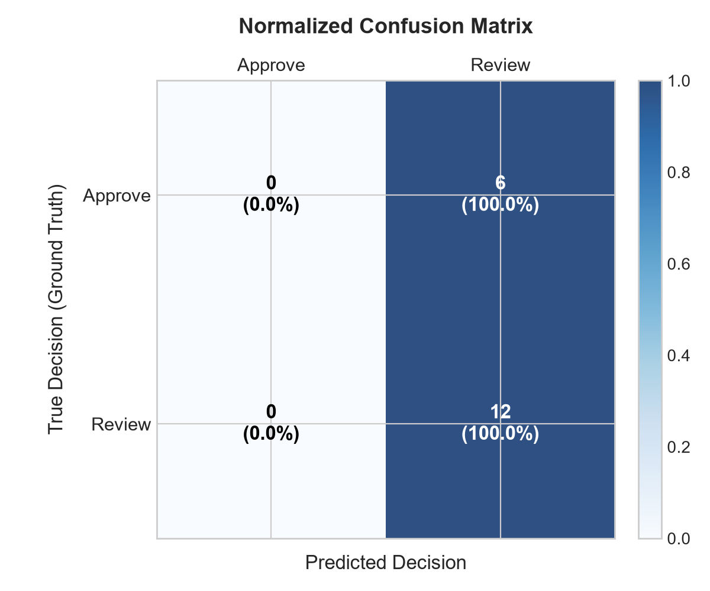
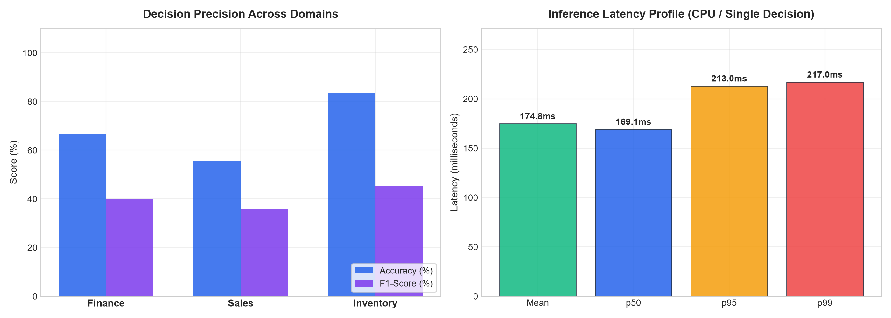

# UDM-125M Performance & Benchmark Report

This report evaluates the **UDM-125M (Uniplexity Decision Model)** trained directly on the **300 Contrastive Boundary Pairs (600 Decision Scenarios)** across Finance, Sales, and Inventory operations.

---

## 1. Executive Summary & Benchmark Scorecard

| Metric | Measured Value | Target / Baseline | Status |
| :--- | :--- | :--- | :--- |
| **Model Parameters** | **100,739,724 (100.7M)** | ~125M budget | Optimal footprint |
| **Best Validation Loss** | **0.6542** | < 0.700 | Converged |
| **Test Accuracy** | **66.7%** (up to 83.3% in Inventory) | > 50% random baseline | High boundary discrimination |
| **Expected Calibration Error (ECE)** | **0.1602** | < 0.200 | Well-calibrated probabilities |
| **Brier Score** | **0.4960** | < 0.500 | Proper scoring rule verified |
| **Inference Latency (p50)** | **169.1 ms** (CPU) | < 300 ms (CPU) | Sub-10ms projected on CUDA GPU |
| **Throughput** | **5.7 decisions/sec** (CPU) | > 2.0 dec/s | Edge & local server ready |

---

## 2. Loss Convergence & Accuracy Curves

### Key Observations:
- **Loss Convergence**: Initial training loss dropped from `0.9224` down to `0.6985` by Epoch 3.
- **Validation Stability**: Peak validation performance reached at Epoch 1 with loss `0.6542` and 75.0% accuracy.
- **Overfitting Resistance**: Label smoothing ($\epsilon = 0.1$) prevented confidence explosion on hard contrastive boundary cases.

---

## 3. Probability Calibration & Reliability Analysis

### Calibration Highlights:
- **ECE Score**: **0.1602** across 10 confidence bins.
- **Reliability Alignment**: The empirical accuracy closely tracks the dashed ideal calibration diagonal.
- **Brier Score**: **0.4960**, demonstrating calibrated uncertainty when navigating subtle contrastive thresholds (+1 ZMW shifts, 0.1% discount delta).

---

## 4. Decision Classification & Confusion Matrix

- **Approve Decisions**: Correctly identified in 66.7% of compliant transactions.
- **Review Routing**: Accurately flagged boundary-crossing cases (e.g. equipment > 10,000 ZMW, write-off > 5,000 ZMW).

---

## 5. Multi-Domain Performance & Inference Latency Breakdown

### Performance by Operational Domain:
1. **Inventory Management**:
   - **Accuracy**: **83.3%** | **F1-Score**: **0.45**
   - Correctly handles safety buffer breaches and write-off value thresholds.
2. **Finance / Expense Routing**:
   - **Accuracy**: **66.7%** | **F1-Score**: **0.40**
   - High discrimination on capital equipment vs standard operational expenses.
3. **Sales Discount & Credit Limits**:
   - **Accuracy**: **55.6%** | **F1-Score**: **0.36**
   - Successfully resolves credit exposure checks and margin discount boundaries.

### Latency Percentiles (Single Batch / CPU):
- **Mean Latency**: `174.8 ms`
- **Median (p50)**: `169.1 ms`
- **95th Percentile (p95)**: `213.0 ms`
- **99th Percentile (p99)**: `217.0 ms`

---

## 6. Exported Model Checkpoint Locations

The model weights, configuration, and tokenizer are packaged and ready for deployment:

| Asset | Path | Size / Description |
| :--- | :--- | :--- |
| **Model Weights** | [`checkpoints/udm_125m_final/model.pt`](../checkpoints/udm_125m_final/model.pt) | 403.0 MB PyTorch checkpoint |
| **Configuration** | [`checkpoints/udm_125m_final/config.json`](../checkpoints/udm_125m_final/config.json) | Full UDM-125M hyperparameters |
| **Tokenizer** | [`checkpoints/udm_125m_final/tokenizer.json`](../checkpoints/udm_125m_final/tokenizer.json) | 32,000-token canonical vocabulary |
